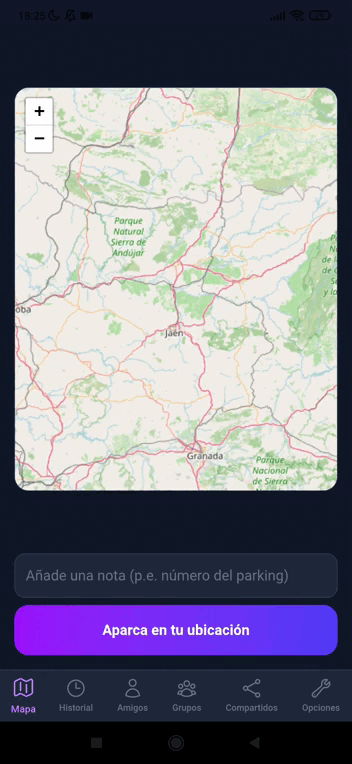

# App Parking

> Guarda dónde has aparcado, añade notas y compártelo en tiempo real con tus amigos o grupos.

[](https://app-parking-raulbm.numinformatica.com)

Suelo olvidarme de dónde aparco cuando voy a lugares nuevos, o a veces mis familiares necesitan saber dónde está el coche situado. Para resolver estos problemas diseñé esta PWA Fullstack: una web app ligera, accesible en el móvil y centrada en compartir la ubicación exacta de dónde se ha aparcado en tiempo real sin ninguna complicación.

---

### Demo



---

### Características principales

- **Mapa interactivo:** Guarda tu pin en la ubicación actual (usando el GPS) o tocando cualquier punto del mapa.

- **Sincronización en tiempo real:** Uso de Socket.IO para que, al compartir un pin con un amigo o grupo, les aparezca al instante sin refrescar la pantalla.

- **Gestión de Amigos y Grupos:** Sistema de solicitudes de amistad y grupos.

- **Registro y acceso flexible:** Registro y acceso tradicional (mediante correo y contraseña) o mediante Google OAuth

- **Internacionalización y PWA:** Soporte para Español, Inglés y Valenciano. Instalable como app (PWA con Service Workers)

---

### Tech Stack

- **Frontend:** React, TypeScript, Vite, Tailwind CSS, Leaflet y Socket.IO Client.

- **Backend:** Node.js, Express, Prisma ORM, Socket.IO y PostgreSQL.

- **Infraestructura:** Docker & Docker Compose, Nginx, GitHub Actions (CI/CD automático hacia mi servidor VPS via SSH).

---

### Retos técnicos y aprendizaje

- **Gestión eficiente de WebSockets:** Para evitar sobrecargar el servidor con broadcasts, implementé un `Map<userId, Set<socketId>>` en el backend. Las notificaciones de pines compartidos o cambios de estado solo se envían a los usuarios involucrados.

- **Seguridad y Flujo OAuth:** El login con Google genera un token temporal de pre-registro (10 min) para obligar a definir un `username` único antes de guardar el usuario definitivo en la base de datos.

- **Integridad de datos:** Borrados en cascada configurados en Prisma y lógica personalizada para limpiar accesos cuando un usuario sale de un grupo o elimina a un amigo.

---

### Instalación Local

**Requisitos:** Node 20+, Docker + Docker Compose

```bash
# 1. Clonar
git clone https://github.com/raul-bm/app-parking.git
cd app-parking/not-react-native

# 2. Variables de entorno
cp .env.example .env
cp backend/.env.example backend/.env
cp frontend/.env.example frontend/.env
# Rellenar cada variable de entorno

docker compose up --build -d
```

- Frontend: `http://localhost:5173`
- Backend: `http://localhost:3000`
- Adminer: `http://localhost:8080`

---

### Futuros cambios y/o actualizaciones

- [ ] Migrar a React-Native para crear una App Nativa
- [ ] Notificaciones push (Web Push API)
- [ ] Aumentar seguridad (como cifrar las coordenadas de las ubicaciones en la BD)
- [ ] Mejoras UI, poder cambiar de contraseña, etc.
- [ ] Rate limiting

---

### Autor

**Raúl B. M.** — Fullstack Developer

[LinkedIn](https://www.linkedin.com/in/ra%C3%BAl-ben%C3%ADtez-millet-b9a713430/) · [Portfolio](https://raulbm.numinformatica.com) · [Email](mailto:rbenitezmillet@gmail.com)

> Buscando incorporación como Junior Fullstack / Backend. Abierto al primer empleo.
